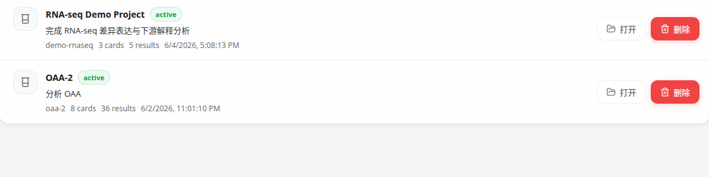
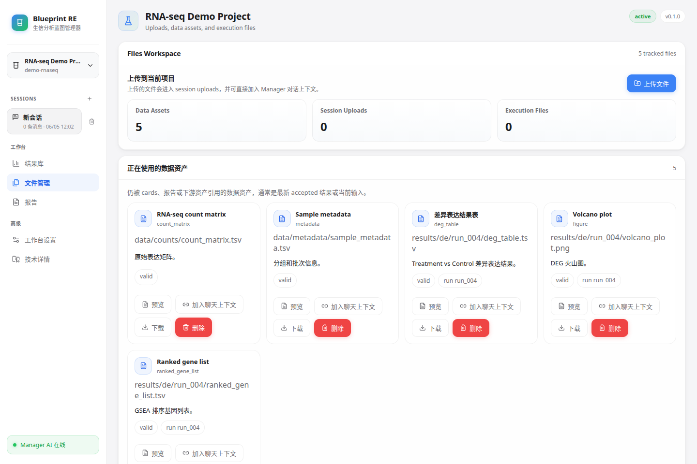
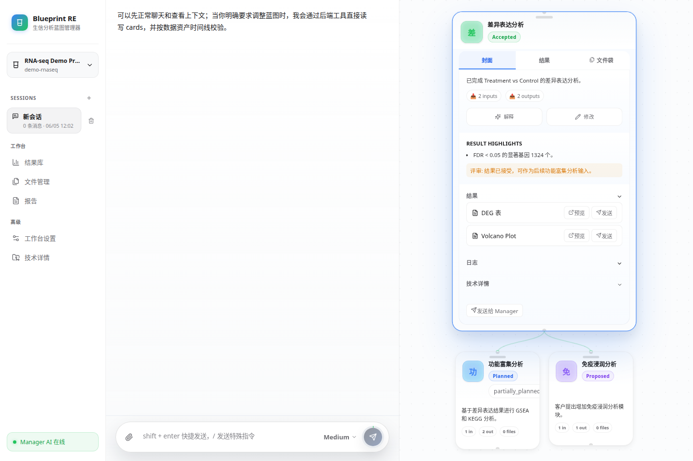

# 莱茵数据实验室（RhineDataLab）

`莱茵数据实验室（RhineDataLab）` 是一个面向科研分析项目的本地工作台，以流程蓝图的方式管理生物信息分析流程，方便对每个步骤进行微调得出准确无误的科学结果。
相比于线性分析的生物信息分析agent，本项目支持用户在分析的过程中：新开分支、修改图片排版、重复单步计算等等微调工作。


## 核心能力

- 用 Manager 对话驱动分析，而不是手工维护大量脚本状态
- 用卡片组织任务、输入、输出、依赖和运行历史
- 在同一个工作台里查看文件、结果、日志和报告
- 用 Reviewer 做结果校验，避免“跑完即结束”
- 把项目状态、会话、运行和资产持久化到本地目录

## 目录

- [核心能力](#核心能力)
- [快速开始](#快速开始)
- [基本使用](#基本使用)
- [常用运维命令](#常用运维命令)
- [关键配置](#关键配置)
- [升级](#升级)
- [卸载](#卸载)
- [本地开发](#本地开发)
- [更多文档](#更多文档)

## 快速开始

### 环境要求

- `systemd --user`
- Linux 用户态 shell
- 基础工具：`bash`、`tar`、`sha256sum`、`curl` 或 `wget`
- 宿主内核/安全策略允许 user namespace 与 `bubblewrap` (`bwrap`)

用户版安装器会在 `~/.local/share/blueprint-re/env` 中准备 Python、Node.js、nginx、bubblewrap 和 git，不需要 `sudo`，也不默认调用 `apt`。默认沙箱模式是 `BLUEPRINT_EXECUTOR_SANDBOX_MODE=bwrap`。如果 `bwrap` smoke test 失败，部署会直接中止，不会静默降级成裸跑。

如果要提前自检 `bubblewrap` 基础能力，可以运行：

```bash
bwrap --die-with-parent --ro-bind / / --dev /dev --proc /proc -- /bin/true
```

### 方式一：让 Agent 安装

如果你本机已经有终端 Agent CLI，这条路径最省事。适用于已安装 Claude Code、Codex、Qoder 等任意终端 Agent CLI 的用户；没有 Agent CLI 请用方式二。

把下面这段 prompt 发给它：

```text
请阅读 https://github.com/solarise94/RhineDataLab 的 README 和 docs/for_agent_install.md，优先使用 release 自解压安装器完成用户目录安装；不要把 Python、Node.js、nginx、git 或 bubblewrap 的宿主预装作为 release installer 的前置条件。安装后验证 backend /healthz 与 nginx gateway，缺少 provider key 时 manager-agent 可记录为 degraded。
```

它会完成安装器获取、依赖能力检查、用户目录 runtime env 引导、前后端与 `manager-agent` 部署、`systemd --user` 启动和烟雾测试。

### 方式二：下载 release 安装器

打开 [GitHub Releases](https://github.com/solarise94/RhineDataLab/releases) 可以查看可用版本。

对普通用户，推荐使用固定入口 `install.sh`。它会自动解析并下载对应版本的自解压安装器、校验 checksum，然后执行：

```bash
curl -fsSL \
  https://github.com/solarise94/RhineDataLab/releases/latest/download/install.sh | \
  bash
```

如果需要安装或回退到指定版本，可以显式传 `VERSION`：

```bash
VERSION=0.4.1
curl -fsSL \
  "https://github.com/solarise94/RhineDataLab/releases/download/v${VERSION}/install.sh" | \
  bash
```

高级用户也可以先手动下载版本化自解压安装器再执行：

```bash
VERSION=0.4.1
curl -fL -o "blueprint-re-${VERSION}-linux-x86_64.sh" \
  "https://github.com/solarise94/RhineDataLab/releases/download/v${VERSION}/blueprint-re-${VERSION}-linux-x86_64.sh"
bash "blueprint-re-${VERSION}-linux-x86_64.sh"
```

安装器会把 release、runtime env、data 和 logs 放到用户目录：

- `~/.local/share/blueprint-re/`
- `~/.config/blueprint-re/`
- `~/.config/systemd/user/`

它会使用预构建 backend wheel、vendored Python dependency wheels、Next.js standalone frontend、manager-agent production dependencies，并生成 user-mode systemd 服务。

开发者源码 checkout 部署仅作为 fallback，不是普通用户安装路径：

```bash
git clone https://github.com/solarise94/RhineDataLab.git
cd RhineDataLab
bash scripts/install_blueprint_re.sh --interactive
```

### 安装完成后

- 前端：`http://127.0.0.1:13001`（nginx gateway）
- 后端：`http://127.0.0.1:18001`
- Next.js：`http://127.0.0.1:13002`（internal）

默认会启动这四个服务：

- `blueprint-re-nginx.service`
- `blueprint-re-backend.service`
- `blueprint-re-manager-agent.service`
- `blueprint-re-frontend.service`

安装成功基线：

```bash
systemctl --user status blueprint-re-nginx.service --no-pager
systemctl --user status blueprint-re-backend.service --no-pager
systemctl --user status blueprint-re-frontend.service --no-pager
systemctl --user status blueprint-re-manager-agent.service --no-pager
curl -fsS http://127.0.0.1:18001/healthz
curl -I http://127.0.0.1:13001
```

期望结果：`blueprint-re-nginx.service`、`blueprint-re-backend.service`、`blueprint-re-frontend.service` 为 `active (running)`；backend `/healthz` 返回 200；nginx gateway 返回 `HTTP/1.1 200 OK` 或等价 2xx/3xx 响应。

缺少 provider credentials 时，`manager-agent` 可以处于 degraded/failing 状态；只要 backend `/healthz` 和 nginx gateway 正常，安装本身仍视为完成。配置 provider key 后再恢复对应能力。

## 基本使用

### 1. 新建项目

浏览器打开 `http://127.0.0.1:13001`，创建项目，或者直接进入已有项目。


### 2. 上传资料

把原始数据、说明文档和参考文件上传到项目里，作为分析输入。



### 3. 告诉 Manager 目标


直接在对话框里描述目标，例如：


- “帮我做这批样本的差异分析”
- “先看看这个 count matrix 的结构，再拆成几个分析卡片”
- “把上次失败的卡片继续推进”

Manager 会根据上下文拆任务、创建或更新卡片，并安排执行。

### 4. 查看卡片和结果

进入项目后，重点看卡片、依赖关系、运行状态和结果产出。卡片详情里可以继续看状态、依赖、结果和失败原因。

### 5. 评审与导出

运行完成后，Reviewer 会做结果校验。通过后可以继续整理报告、导出结果，或者让 Manager 推进下一步。

## 常用运维命令

查看服务状态：

```bash
systemctl --user status blueprint-re-nginx.service
systemctl --user status blueprint-re-manager-agent.service
systemctl --user status blueprint-re-backend.service
systemctl --user status blueprint-re-frontend.service
```

重启服务：

```bash
systemctl --user restart blueprint-re-nginx.service
systemctl --user restart blueprint-re-manager-agent.service
systemctl --user restart blueprint-re-backend.service
systemctl --user restart blueprint-re-frontend.service
```

看日志：

```bash
journalctl --user -u blueprint-re-nginx.service -n 100 --no-pager
journalctl --user -u blueprint-re-manager-agent.service -n 100 --no-pager
journalctl --user -u blueprint-re-backend.service -n 100 --no-pager
journalctl --user -u blueprint-re-frontend.service -n 100 --no-pager
```

## 关键配置

Provider 凭据不是安装 gate。未配置 key 时，应用可以安装并启动基础服务；调用 provider-backed Manager / pi 执行能力时才需要配置。

常用 provider 配置：

```env
BLUEPRINT_DEEPSEEK_API_BASE_URL=https://api.deepseek.com/anthropic
BLUEPRINT_DEEPSEEK_API_KEY=sk-your-key
BLUEPRINT_PI_DEEPSEEK_BASE_URL=https://api.deepseek.com
BLUEPRINT_MANAGER_MODEL=deepseek-v4-pro
BLUEPRINT_MANAGER_BACKEND=pi
```

常用扩展配置：

- `BLUEPRINT_EXECUTOR_MODEL=deepseek-v4-flash`
- `BLUEPRINT_REVIEWER_MODEL=deepseek-v4-flash`
- `BLUEPRINT_REVIEWER_MAX_TURNS=24`
- `MANAGER_WEBSEARCH_ENABLED=true`
- `TAVILY_API_KEY=...`
- `MANAGER_CONTEXT_WINDOW_TOKENS=1000000`
- `MANAGER_COMPACTION_ENABLED=true`

完整模板见 [.env.example](.env.example)。

## 升级

升级时，重新运行固定的 `install.sh` 入口即可。安装器会自动检测已有安装、停止 user services、部署新 release、切换 `current` symlink，并保留 `~/.local/share/blueprint-re/data/` 中的项目数据。

```bash
curl -fsSL \
  https://github.com/solarise94/RhineDataLab/releases/latest/download/install.sh | \
  bash
```

如果需要升级到或回退到指定版本：

```bash
VERSION=0.4.2
curl -fsSL \
  "https://github.com/solarise94/RhineDataLab/releases/download/v${VERSION}/install.sh" | \
  bash
```

如果新版本有问题，可以用同一个入口触发回滚，切回本机仍保留的旧版本：

```bash
curl -fsSL \
  https://github.com/solarise94/RhineDataLab/releases/latest/download/install.sh | \
  bash -s -- --rollback <previous-version>
```

rollback 可以使用任意版本的安装器入口，只要目标版本目录仍在本机 `~/.local/share/blueprint-re/releases/` 下。

`<previous-version>` 是本机 `~/.local/share/blueprint-re/releases/` 下仍存在的旧版本目录名。安装器默认只保留最近 2 个版本，更早版本可能已被清理。全新机器、手动清理过 `releases/` 目录、或目标版本已被回收时，rollback 会直接失败。

## 卸载

默认卸载服务和 release 文件，并保留项目数据：

```bash
bash ~/.local/share/blueprint-re/current/scripts/uninstall.sh
```

项目数据默认保留在 `~/.local/share/blueprint-re/data/`。如需同时删除项目数据，显式加 `--purge-data`：

```bash
bash ~/.local/share/blueprint-re/current/scripts/uninstall.sh --purge-data
```

## 仓库结构

```text
backend/        FastAPI 后端
frontend/       Next.js 前端
manager-agent/  Manager AI sidecar
deploy/         systemd 用户服务模板
scripts/        部署、迁移、安装、烟测脚本
docs/           产品与实现文档
workspace/      本地运行时项目数据（不纳入仓库）
```

## 本地开发

后端：

```bash
python3.13 -m venv .venv/backend
.venv/backend/bin/pip install -e backend
.venv/backend/bin/python scripts/generate_backend_schemas.py
.venv/backend/bin/uvicorn app.main:app --app-dir backend --reload --host 127.0.0.1 --port 18001
```

前端：

```bash
cd frontend
npm install
NEXT_PUBLIC_API_BASE_URL=http://127.0.0.1:18001/api NEXT_PUBLIC_UPLOAD_API_BASE_URL=http://127.0.0.1:18001/api npm run dev
```

Manager agent：

```bash
cd manager-agent
npm install
npm start
```

## 测试

后端：

```bash
PYTHONPATH=backend .venv/backend/bin/python -m unittest discover -s backend/tests
```

前端构建校验：

```bash
cd frontend
npm run build
```

Manager agent 语法检查：

```bash
node --check manager-agent/src/server.js
```

## 更多文档

普通安装和使用：

- Agent 安装指引：[docs/for_agent_install.md](docs/for_agent_install.md)
- 文档导航：[docs/README.md](docs/README.md)
- 用户模式 release installer 设计：[docs/51_user_mode_release_bundle_and_installer_plan.md](docs/51_user_mode_release_bundle_and_installer_plan.md)

开发者文档：

- [docs/13_fork_architecture_and_product_logic.md](docs/13_fork_architecture_and_product_logic.md)
- [docs/15_manager_runtime_libraries_and_report_plan.md](docs/15_manager_runtime_libraries_and_report_plan.md)
- [docs/16_skill_mcp_registry_and_wrapper_attachment_plan.md](docs/16_skill_mcp_registry_and_wrapper_attachment_plan.md)
- [docs/17_explicit_output_contract_and_submission_validation_plan.md](docs/17_explicit_output_contract_and_submission_validation_plan.md)
- [docs/22_dependency_attention_and_provider_hardening.md](docs/22_dependency_attention_and_provider_hardening.md)
